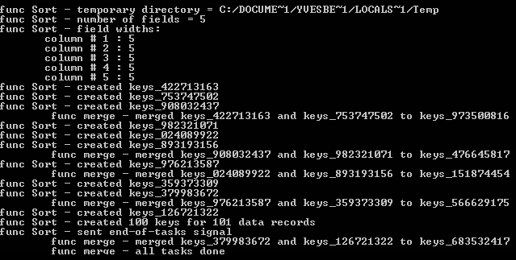

# mergesort

Go package for doing a stable, multi-index, partially concurrent merge sort of a text file.


## Install

To install the package and its demo:
```sh
go get -u github.com/ybeaudoin/go-mergesort
```

## At a glance

The package exports the following:
 * Function:
   * `Sort(inFile, outFile string, sortAsc bool, usingFields, sep string, keysPerSort int, verbose bool)`  
     Does a stable, multi-index, partially concurrent hybrid merge sort of a text file.

## Arguments

| Field | Description |
| --- | --- |
|inFile|path of the file with the data to be sorted|
|outFile|path of the file for the sorted data|
|sortAsc|boolean flag for requesting an ascending alphanumeric sort. If false, sorting will be in descending order|
|usingFields|CSV of field numbers to use as indexes, ordered as primary, secondary, etc., with the first field referenced as 1|
|sep|the field separator|
|keysPerSort|the number of elements for in-place sorting of the initial composite-key files|
|verbose|boolean flag for verbose mode. If true, the main execution stages will be echoed to Stdout (as illustrated above)|

## Remarks

The merge sort technique was devised by John von Neumann in 1945<sup>[\[1\]](https://en.wikipedia.org/wiki/Merge_sort)</sup>.
Many variants have been devised since then. Our implementation is a **hybrib** type. In a traditional hybrid algorithm, "...the
initial pass will read many records into memory, do an internal sort to create a long run, and then distribute those long runs
onto the output set." In our case, we use "keys" instead of the records themselves to avoid parsing the fields repeatedly. Each
key consists of just the record's index fields, appropriately formatted in the order specified, with an offset to the
record-start appended. Consequently, no two keys can be identical. Thus the algorithm is **stable** "which means that the
implementation preserves the input order of equal elements in the sorted
output"<sup>[\[1\]](https://en.wikipedia.org/wiki/Merge_sort)</sup>.

During the initial pass, after every two long key runs have been created, "Sort" instructs its coroutine "merge" to sort
these in the traditional merge sort manner. This concurrency remains in effect until all the initial long runs have been
created:



Note that the basenames of the temporary files are all prefixed as "keys_".

Thereafter, processing of these merged runs is essentially sequential. Function "Sort" just does a directory listing of the
resulting merged key files and pairs them up for further processing by the coroutine. It then repeats these steps until a single
file remains in the temporary directory. This insures that the paired key files are as comparable in size as possible in order
to minimize the i/o operations on unprocessed keys when one of the files runs out of data:


Once a single key file is obtained, "Sort" reads each key to retrieve the associated source record offset. It then locates the
specified record in the source file and copies it to the specified target file. And this is repeated until all the keys have
been process.

Finally note that adding more coroutines inhibits performance as the i/o sub-system becomes taxed by the additional contending
requests.

## Reference

1. https://en.wikipedia.org/wiki/Merge_sort

## MIT License

Copyright (c) 2016 Yves Beaudoin webpraxis@gmail.com

See the file LICENSE for copying permission.


